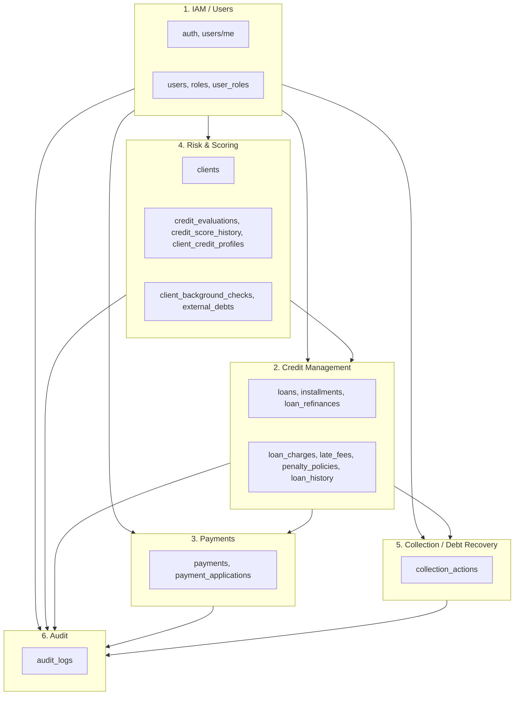

# Bounded Contexts – CashUp (DDD)

Este documento define la segregación de **Bounded Contexts** del sistema de gestión de préstamos CashUp, con sus propósitos, tablas, endpoints y estructura de carpetas.

---

## 1. Visión general

| # | Bounded Context | Propósito principal |
|---|-----------------|---------------------|
| 1 | **IAM / Users** | Gestión de autenticación, usuarios, perfiles, roles y auditoría de acciones del usuario. |
| 2 | **Credit Management** | Préstamos, refinanciamientos, cuotas, cargos, mora y políticas asociadas. |
| 3 | **Payments** | Registro y distribución de pagos entre cuotas (parciales o adelantados). |
| 4 | **Risk & Scoring** | Evaluación de riesgo, puntaje, verificaciones externas y antecedentes de clientes. |
| 5 | **Collection / Debt Recovery** | Gestiones de cobranza y recuperación de pagos pendientes. |
| 6 | **Audit** | Trazabilidad de acciones críticas y cambios en el sistema (cumplimiento y debugging). |

---

## 2. Bounded Contexts en detalle

### 1️⃣ IAM / Users Context

**Propósito:** Gestión de autenticación, usuarios y perfiles.

**Incluye:**
- Registro, login, refresh token, logout
- Gestión de perfil del usuario (GET/PUT/DELETE)
- Roles y permisos
- Auditoría de acciones del usuario (`audit_logs`)

**Tablas / entidades:**
- `users` – Usuarios del sistema (administradores, analistas, cobradores).
- `roles` – Perfiles que definen permisos.
- `user_roles` – Asignación usuario–rol.
- `audit_logs` – Para auditoría de acciones del usuario (registro de login, cambios de perfil, etc.).

**Lenguaje ubicuo:** Usuario, Rol, Permiso, Sesión, Credencial, Perfil, Token.

**Endpoints:**

| Método | Ruta | Descripción |
|--------|------|-------------|
| POST | `/auth/register` | Registro de usuario |
| POST | `/auth/login` | Login |
| POST | `/auth/refresh-token` | Renovar token |
| POST | `/auth/logout` | Cerrar sesión |
| GET | `/users/me` | Obtener perfil del usuario autenticado |
| PUT | `/users/me` | Actualizar perfil |
| DELETE | `/users/me` | Eliminar cuenta / desactivar usuario |

**Agregados sugeridos:** User (AR): User + UserRoles. Role como entidad o agregado pequeño.

**Estructura de carpetas:** `src/iam-users/`

---

### 2️⃣ Credit Management Context

**Propósito:** Manejo de préstamos, refinanciamientos, cuotas, cargos, mora y políticas asociadas.

**Incluye:**
- Crear préstamos
- Simulación de crédito
- Refinanciamientos
- Gestión de cuotas (installments)
- Aplicación de cargos adicionales (loan_charges)
- Cálculo y aplicación de penalidades por mora (late_fees, penalty_policies)
- Historial de préstamos (loan_history)

**Tablas / entidades:**
- `loans` – Préstamos (monto, tasa, plazo, tipo de interés, estado).
- `loan_refinances` – Vinculación préstamo original → nuevo.
- `installments` – Cuotas del cronograma.
- `loan_charges` – Cargos adicionales (comisiones, seguros, gastos).
- `penalty_policies` – Reglas de cálculo de mora (porcentaje, días de gracia, tipo).
- `late_fees` – Penalidades generadas por atraso en cuotas.
- `loan_history` – Historial de cambios del préstamo.

**Lenguaje ubicuo:** Préstamo (Crédito), Cuota, Cronograma, Simulación, Refinanciamiento, Cargo, Mora, Política de penalidad, Desembolso, Aprobación, Rechazo.

**Endpoints:**

| Método | Ruta | Descripción |
|--------|------|-------------|
| POST | `/credits/simulate` | Simulación de crédito (cuota, total, sin persistir) |
| POST | `/credits` | Crear préstamo |
| GET | `/credits` | Listar préstamos (con filtros) |
| GET | `/credits/:creditId` | Detalle de un préstamo |
| GET | `/credits/:creditId/schedule` | Cronograma de cuotas |
| GET | `/credits/active` | Préstamos activos |
| GET | `/credits/history` | Historial de préstamos |
| PATCH | `/credits/:creditId/approve` | Aprobar préstamo |
| PATCH | `/credits/:creditId/reject` | Rechazar préstamo |

**Agregados sugeridos:** Loan (AR): Loan + Installments + LoanCharges + LoanHistory + LateFees. LoanRefinance (AR). PenaltyPolicy (entidad/AR pequeño).

**Estructura de carpetas:** `src/credit-management/`

---

### 3️⃣ Payments Context

**Propósito:** Registro y distribución de pagos de los clientes.

**Incluye:**
- Registrar pagos
- Distribuir pagos entre cuotas (`payment_applications`)
- Seguimiento de pagos por préstamo o global
- Gestión de pagos parciales y pagos adelantados

**Tablas / entidades:**
- `payments` – Dinero recibido (monto, método, referencia, fecha).
- `payment_applications` – Distribución del pago entre principal, interés y mora por cuota(s).

**Lenguaje ubicuo:** Pago, Aplicación de pago, Pago parcial, Pago adelantado, Método de pago.

**Endpoints:**

| Método | Ruta | Descripción |
|--------|------|-------------|
| POST | `/payments` | Registrar un pago |
| GET | `/payments` | Listar pagos (global o filtrados) |
| GET | `/payments/:paymentId` | Detalle de un pago |
| GET | `/credits/:creditId/payments` | Pagos de un préstamo |

**Agregados sugeridos:** Payment (AR): Payment + PaymentApplication[].

**Estructura de carpetas:** `src/payments/`

---

### 4️⃣ Risk & Scoring Context

**Propósito:** Evaluación de riesgo, puntaje de crédito, verificaciones externas y antecedentes de clientes.

**Incluye:**
- Evaluación crediticia (`credit_evaluations`)
- Historial de puntaje (`credit_score_history`)
- Verificaciones externas judiciales o de listas de riesgo (`client_background_checks`)
- Seguimiento de deudas externas (`external_debts`)

**Tablas / entidades:**
- `credit_evaluations` – Evaluaciones de riesgo (puntaje, resultado, factores, evaluador).
- `credit_score_history` – Historial del puntaje del cliente en el tiempo.
- `client_background_checks` – Verificaciones (judiciales, listas de riesgo, validaciones externas).
- `external_debts` – Deudas externas para nivel de endeudamiento.
- `client_credit_profiles` – Perfil actual: puntaje, nivel de riesgo, total deuda, pagos a tiempo/atrasados.
- `clients` – Información general del cliente (sujeto de evaluación y scoring).

**Lenguaje ubicuo:** Evaluación crediticia, Puntaje, Scoring, Verificación de antecedentes, Deuda externa, Perfil crediticio, Riesgo.

**Endpoints:**

| Método | Ruta | Descripción |
|--------|------|-------------|
| GET | `/scoring/me` | Puntaje / perfil de scoring del cliente (o del usuario asociado) |
| POST | `/scoring/recalculate` | Recalcular puntaje (tras nuevos datos o pagos) |

**Agregados sugeridos:** CreditEvaluation (AR). Client (AR): Client + ClientBackgroundCheck[] + ExternalDebt[]. ClientCreditProfile (AR) + CreditScoreHistory.

**Estructura de carpetas:** `src/risk-scoring/`

---

### 5️⃣ Collection / Debt Recovery Context

**Propósito:** Gestiones de cobranza y acciones para recuperar pagos pendientes.

**Incluye:**
- Registrar gestiones de cobranza (llamadas, emails, visitas, legales)
- Seguimiento del estado de cobranza por cliente/préstamo

**Tablas involucradas:**
- `collection_actions` – Registro de gestiones (tipo, resultado, fecha, préstamo/cliente).
- `clients` – Referencia al cliente.
- `loans` – Referencia al préstamo (opcional).

**Lenguaje ubicuo:** Gestión de cobranza, Llamada, Email, Visita, Aviso, Acción legal, Recuperación, Morosidad.

**Endpoints (sugeridos):**

| Método | Ruta | Descripción |
|--------|------|-------------|
| POST | `/collections/actions` | Registrar gestión de cobranza |
| GET | `/collections/actions` | Listar gestiones (por cliente, préstamo o fecha) |
| GET | `/collections/clients/:clientId` | Estado de cobranza por cliente |
| GET | `/collections/credits/:creditId` | Gestiones asociadas a un préstamo |

**Agregados sugeridos:** CollectionAction (AR): referencia clientId, loanId (opcional), tipo, resultado, fecha.

**Estructura de carpetas:** `src/collection-debt-recovery/`

---

### 6️⃣ Audit Context

**Propósito:** Trazabilidad de acciones críticas y cambios en el sistema.

**Incluye:**
- Registrar auditoría de préstamos, pagos, scoring, usuarios y demás acciones sensibles
- Mantener historial de cambios para cumplimiento y debugging

**Tablas involucradas:**
- `audit_logs` – Acción, tipo de entidad, id de entidad, valores antiguos/nuevos, usuario, IP, user-agent, fecha.

**Lenguaje ubicuo:** Evento de auditoría, Acción, Entidad, Cambio, Trazabilidad.

**Uso:** Los demás contextos (IAM, Credit Management, Payments, Risk & Scoring, Collection) invocan al contexto Audit al ejecutar acciones críticas (crear préstamo, aprobar, registrar pago, cambiar scoring, etc.). No suele exponer endpoints públicos de escritura; sí puede exponer **GET** para consulta (ej. `GET /audit/logs` para administradores).

**Agregados sugeridos:** AuditLog (entidad o AR mínimo).

**Estructura de carpetas:** `src/audit/`

---

## 3. Resumen: tablas por Bounded Context

| Bounded Context | Tablas |
|-----------------|--------|
| **IAM / Users** | `users`, `roles`, `user_roles`, `audit_logs` (auditoría de usuario) |
| **Credit Management** | `loans`, `loan_refinances`, `installments`, `loan_charges`, `penalty_policies`, `late_fees`, `loan_history` |
| **Payments** | `payments`, `payment_applications` |
| **Risk & Scoring** | `clients`, `credit_evaluations`, `credit_score_history`, `client_background_checks`, `external_debts`, `client_credit_profiles` |
| **Collection / Debt Recovery** | `collection_actions` (referencias: `clients`, `loans`) |
| **Audit** | `audit_logs` (registro desde todos los contextos) |

**Nota:** `audit_logs` es compartida: IAM puede escribir auditoría de acciones de usuario; el contexto Audit centraliza la responsabilidad de trazabilidad y puede ser el único que escribe, o todos los BCs escriben con el mismo formato. Decisión de implementación.

---

## 4. Mapa de contextos (Context Map)

```
┌─────────────────────┐
│   IAM / Users        │  userId, roles → todos
│   auth, users/me     │
└──────────┬──────────┘
           │
           ├──────────────────────────────────────────────────┐
           ▼                      ▼                            ▼
┌─────────────────────┐  ┌─────────────────────┐  ┌─────────────────────┐
│ Risk & Scoring      │  │ Credit Management   │  │ Payments             │
│ clients, scoring,   │──▶ credits, schedule,  │◀─▶ payments,           │
│ evaluations,        │   approve/reject,     │   applications         │
│ background_checks   │   late_fees, policies  │                       │
└─────────────────────┘  └──────────┬──────────┘  └─────────────────────┘
                                     │
                                     ▼
                          ┌─────────────────────┐
                          │ Collection /        │
                          │ Debt Recovery       │
                          │ collection_actions  │
                          └──────────┬──────────┘
                                     │
           ┌─────────────────────────┼─────────────────────────┐
           ▼                         ▼                         ▼
┌─────────────────────┐
│ Audit                │  ← Todos los contextos registran eventos
│ audit_logs           │
└─────────────────────┘
```

**Relaciones:**
- **IAM / Users** → Todos: provee `userId` (actor) y roles/permisos.
- **Risk & Scoring** → **Credit Management**: evaluación y puntaje para aprobar/crear créditos.
- **Credit Management** ↔ **Payments**: cuotas a las que se aplican pagos; pagos actualizan estado de cuotas.
- **Credit Management** → **Collection**: préstamos/clientes con mora para gestiones de cobranza.
- **Todos** → **Audit**: registro de acciones críticas.

---

## 5. Diagrama Mermaid



---

## 6. Estructura de carpetas por Bounded Context

Cada BC tiene su propio paquete con `domain`, `application` e `infrastructure`. La API y el container hacen el wiring.

```
src/
├── shared/                              # Opcional: value objects, Prisma client
│   ├── domain/
│   │   └── value-objects/               # Money, DateRange, etc.
│   └── infrastructure/
│       └── persistence/
│
├── iam-users/
│   ├── domain/
│   │   ├── entities/                    # User, Role, UserRole
│   │   └── repositories/               # IUserRepository, IRoleRepository
│   ├── application/
│   │   └── use-cases/                   # RegisterUser, LoginUser, RefreshToken, Logout, GetMe, UpdateMe, DeleteMe
│   └── infrastructure/                 # PrismaUserRepository, JwtService, BcryptHasher
│
├── credit-management/
│   ├── domain/
│   │   ├── entities/                    # Loan, Installment, LoanRefinance, LoanCharge, LoanHistory, PenaltyPolicy, LateFee
│   │   ├── services/                   # AmortizationDomainService (simulación, cronograma, interés)
│   │   └── repositories/               # ILoanRepository, IInstallmentRepository, IPenaltyPolicyRepository
│   ├── application/
│   │   └── use-cases/                   # SimulateCredit, CreateCredit, GetCredits, GetCreditById, GetSchedule, ApproveCredit, RejectCredit, RefinanceLoan
│   └── infrastructure/
│
├── payments/
│   ├── domain/
│   │   ├── entities/                   # Payment, PaymentApplication
│   │   └── repositories/               # IPaymentRepository
│   ├── application/
│   │   └── use-cases/                   # RecordPayment, ApplyPaymentToInstallments, GetPayments, GetPaymentsByCredit
│   └── infrastructure/
│
├── risk-scoring/
│   ├── domain/
│   │   ├── entities/                   # Client, CreditEvaluation, ClientBackgroundCheck, ExternalDebt, CreditScoreHistory, ClientCreditProfile
│   │   ├── services/                   # CreditScoringDomainService (scoring, reglas)
│   │   └── repositories/              # IClientRepository, ICreditEvaluationRepository, IClientCreditProfileRepository
│   ├── application/
│   │   └── use-cases/                   # GetScoringMe, RecalculateScoring, EvaluateCredit, RecordBackgroundCheck, RecordExternalDebt
│   └── infrastructure/
│
├── collection-debt-recovery/
│   ├── domain/
│   │   ├── entities/                   # CollectionAction
│   │   └── repositories/               # ICollectionActionRepository
│   ├── application/
│   │   └── use-cases/                   # RegisterCollectionAction, GetCollectionActionsByClient, GetCollectionActionsByCredit
│   └── infrastructure/
│
├── audit/
│   ├── domain/
│   │   ├── entities/                   # AuditLog
│   │   └── repositories/              # IAuditLogRepository
│   ├── application/
│   │   └── use-cases/                   # RecordAuditEvent
│   └── infrastructure/
│
├── api/
│   ├── routes/                         # auth, users, credits, payments, scoring, collections, audit
│   ├── middleware/                     # auth, roles, errorHandler
│   └── controllers/                    # (opcional)
│
├── config/
├── container.js                         # Wiring por BC
└── app.js / index.js
```

---

## 7. Endpoints por contexto (referencia rápida)

| Contexto | Endpoints |
|----------|-----------|
| **IAM / Users** | `POST /auth/register`, `POST /auth/login`, `POST /auth/refresh-token`, `POST /auth/logout`, `GET /users/me`, `PUT /users/me`, `DELETE /users/me` |
| **Credit Management** | `POST /credits/simulate`, `POST /credits`, `GET /credits`, `GET /credits/:creditId`, `GET /credits/:creditId/schedule`, `GET /credits/active`, `GET /credits/history`, `PATCH /credits/:creditId/approve`, `PATCH /credits/:creditId/reject` |
| **Payments** | `POST /payments`, `GET /payments`, `GET /payments/:paymentId`, `GET /credits/:creditId/payments` |
| **Risk & Scoring** | `GET /scoring/me`, `POST /scoring/recalculate` |
| **Collection / Debt Recovery** | Registrar y consultar gestiones de cobranza (por cliente/préstamo) |
| **Audit** | Consulta de logs (ej. `GET /audit/logs`) para administradores |

Con esta segregación, el proyecto queda alineado con tus Bounded Contexts y con la arquitectura DDD por carpetas.
